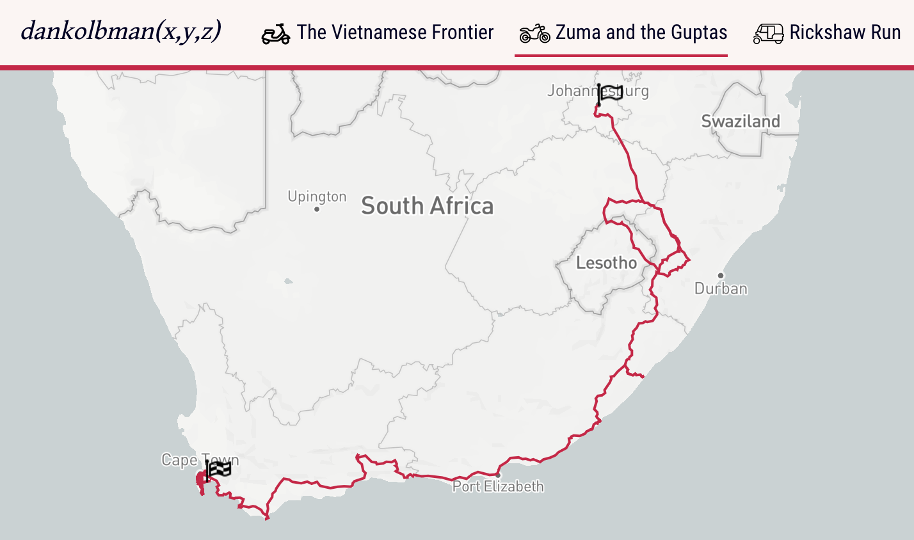

# Roundabout



> The world is my oyster, make it yours too

Simple travel maps of my ~~shenanigans~~ adventures.

### Install and Run
```
yarn
yarn start
```
But it's no fun without the [API](https://github.com/dankolbman/detour)!

### Docker

Included is a `Dockerfile` that will bundle the application, then serve it via nginx.
Useful for deployment in a full `docker-compose` set up.
